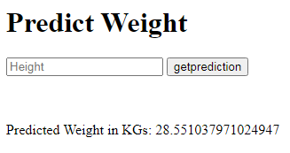

 
## Project Overview:
In this Data Science project, our goal is to deploy a Machine Learning model that predicts a person's weight based on their height. The model has already been trained and tested, and now we are ready to create an interactive interface that allows users to make real-time predictions.

## Project Steps:
Prerequisites:
Ensure that the Machine Learning model is ready and available in a file. If necessary, perform training and evaluation in a separate project.

## Environment Setup:
Configure the environment properly for deployment. In Google Colab, you can use Gradio or Flask with ngrok. If using another platform, check available options.

## Choose Deployment Approach:
Select the best approach between Gradio and Flask with ngrok based on your project requirements. Both approaches enable the creation of interactive interfaces for weight prediction based on height.

## Model Import:
Load the pre-trained model using the appropriate library, such as pickle for Gradio or any other library for Flask.

##Interface Creation:
Use Gradio or Flask libraries to create a user-friendly interface where users can input height and receive real-time weight predictions.

## Testing and Validation:
After creating the interface, perform tests to ensure everything functions as expected. Verify that the model makes accurate predictions and that the interface is intuitive and responsive.

## Documentation:
Provide comprehensive documentation to facilitate project usage by others or team members. Explain the project's purpose, how to run it, and how to interpret results.

## Deployment and Sharing:
Deploy the project on a server or platform of choice, allowing others to access the interface and make weight predictions based on height. Share the link or code with the team or the public if needed.

## Final Thoughts:
The deployment project is a crucial step in applying Machine Learning models practically. With the interactive interface, users can experience the model in real-world scenarios, making it more useful and accessible.

Ensure to document the entire deployment process for easy maintenance and sharing of the project. With well-organized steps and a functional interface, you will provide an effective and impactful solution with your weight prediction model.

If you have more questions or need further assistance, please let me know! I'm here to help.
